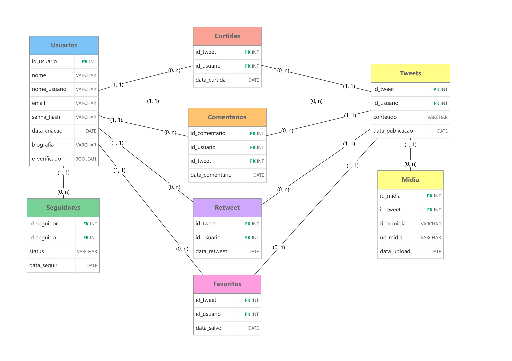

# Projeto Final — Banco de Dados I (2026.2)

Modelagem do banco de dados que sustentaria uma rede social no estilo **Twitter**: usuários publicando posts curtos (tweets), curtindo, comentando, seguindo outros usuários, retweetando, salvando favoritos e anexando mídias aos tweets.

## Integrantes
- João Victor Reis Lisboa 
- João Emannuel Neves De Brito

## Sistema escolhido
**Twitter**

Pergunta-guia do projeto: como esse sistema foi (ou seria) desenvolvido por baixo do capô?

O recorte do projeto cobre o núcleo funcional do produto:
- Cadastro de usuários
- Publicação de tweets
- Anexação de mídias (imagens, vídeos, gifs) a tweets
- Curtidas em tweets
- Comentários (respostas) em tweets
- Relação de "seguir" entre usuários, com fluxo de aprovação (pendente/aprovado/reprovado)
- Retweets (compartilhamento de tweets existentes)
- Favoritos (salvar tweets de forma privada)
- Suporte a contas privadas
- Povoamento do banco com dados de exemplo

## Tecnologias utilizadas
- **PostgreSQL** — banco de dados relacional
- **Supabase** — hospedagem gerenciada do PostgreSQL, usada para desenvolvimento e testes
- **SQL (DDL/DML)** — modelagem de schema e manipulação de dados via migrations

## Entidades principais

| Entidade | Descrição |
|---|---|
| `usuarios` | Pessoas cadastradas na plataforma |
| `tweets` | Publicações feitas por um usuário |
| `midias` | Imagens, vídeos ou gifs anexados a um tweet |
| `curtidas` | Registro de um usuário curtindo um tweet |
| `comentarios` | Respostas de usuários a um tweet |
| `seguidores` | Relação N:N entre usuários (quem segue quem), com status de aprovação |
| `retweets` | Registro de um usuário compartilhando (retweetando) um tweet |
| `favoritos` | Registro de um usuário salvando um tweet de forma privada |

## Modelo Entidade-Relacionamento

## Relacionamentos

- Um **usuário** pode publicar vários **tweets** (1:N)
- Um **tweet** pode ter várias **mídias** anexadas, e cada mídia pertence a exatamente um tweet (1:N)
- Um **usuário** pode curtir vários **tweets**, e um **tweet** pode ser curtido por vários **usuários** (N:N, resolvido pela entidade `curtidas`)
- Um **usuário** pode comentar vários **tweets**, e um **tweet** pode ter vários **comentários** (1:N a partir do tweet, N:1 a partir do usuário)
- Um **usuário** pode seguir vários **usuários**, e ser seguido por vários (N:N, auto-relacionamento resolvido pela entidade `seguidores`)
- Cada relação de seguir possui um **status** (`pendente`, `aprovado` ou `reprovado`), simulando contas privadas que precisam aprovar pedidos
- Um **usuário** pode retweetar vários **tweets**, e um **tweet** pode ser retweetado por vários **usuários** (N:N, resolvido pela entidade `retweets`)
- Um **usuário** pode favoritar vários **tweets** de forma privada (N:N, resolvido pela entidade `favoritos`)
- A partir da migration 003, `usuarios` também possui `biografia` e `e_verificado` (selo de verificação)
- A partir da migration 006, `usuarios` também possui suporte a **conta privada**, controlando a visibilidade do perfil

## Migrations

| Ordem | Arquivo | Descrição |
|---|---|---|
| 1 | `001_init.sql` | Criação inicial do schema |
| 2 | `002_adiciona_retweets.sql` | Adiciona suporte a retweets |
| 3 | `003_atualiza_perfil_usuarios.sql` | Adiciona biografia e selo de verificação a `usuarios` |
| 4 | `004_adiciona_favoritos.sql` | Adiciona suporte a favoritos |
| 5 | `005_adiciona_midias.sql` | Adiciona suporte a mídias em tweets |
| 6 | `006_suporte_conta_privada.sql` | Adiciona suporte a contas privadas |
| 7 | `007_povoamento_banco.sql` | Povoamento do banco com dados de exemplo (seed) |

## Como rodar no Supabase

O projeto usa o **Supabase** (PostgreSQL gerenciado) para desenvolvimento e testes.

1. Criar uma conta gratuita em [supabase.com](https://supabase.com) e criar um novo projeto.
2. Abrir o **SQL Editor** do projeto no Supabase.
3. Executar as migrações **em ordem**, uma por vez, copiando o conteúdo de cada arquivo em `migrations/`:
   `001_init.sql` → `002_adiciona_retweets.sql` → `003_atualiza_perfil_usuarios.sql` → `004_adiciona_favoritos.sql` → `005_adiciona_midias.sql` → `006_suporte_conta_privada.sql` → `007_povoamento_banco.sql`
